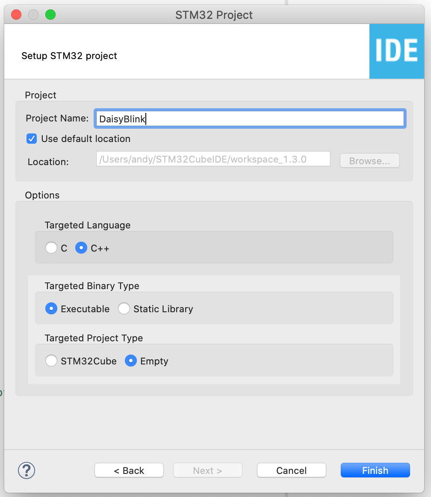
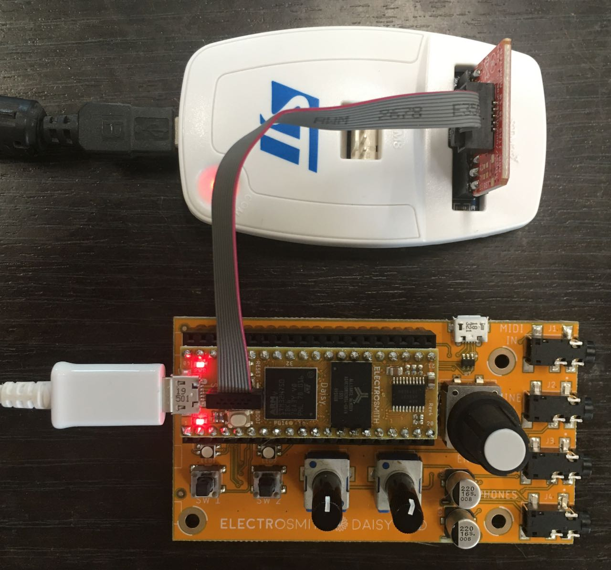

# DaisySTM32CubeIdeDemo

## Creating a project from Scratch

How to create an STM32CubeIde project for Daisy. This example is for Mac OS, but Windows and Linux should be similar. STM32CubeIde is a free Eclipse based IDE supported by ST, and runs on all three major desktop platforms.

First, you'll need to get the Daisy project code from GitHub. I just used the DaisyExamples repo that I found there. Before you create the project, you will have to build the libraries libDaisy and DaisySP, so they can be included in the project. There are makefiles for that.

After that, open up STM32CubeIDE and New -> Create New Project from the Project Explorer pane.

The Target Selector should open up. For MCU/MPU Selector, type 750 into the search box, then choose STM32H750IB:

Select the BGA package:

Next you'll get this pane:

If you select "Use default location", the project will be placed in the workspace folder. You can put it where you want. Make sure to select "Empty". At this point you'll have an empty project. There a lot of different ways to organize the project folders, I'll just use the default organization created by the wizard.

From here, the idea is to use the existing makefiles for the Blink example as a guide for filling in the project options, such as include folders and libraries. First, to make the project more portable, I create an STM32CubeIde environment variable to point to the DaisyExamples folder on my computer. In the Project Explorer, select Properties for the project, then select C/C++ Build -> Environment:

 

Create a new variable (I called it DAISY) and point it to your DaisyExamples folder:

 

Now we add the include paths found in the makefile to the project. These are in a shared included makefile in libdaisy/core. One example found in the makefile would be $(LIBDAISY_DIR)/src. To add that path, go to Project Properties -> C/C++ General -> Paths and Symbols -> Include Tab -> Add. Make sure to check Add to All Configurations and Add to All Languages

Now add all the other include paths found in the makefile into the project.

In a similar manner, we add the Library Paths and Libraries for the libdaisy and DaisySP libraries. The way that GCC works is that you need to add the library paths, you can't just specify a library with a full path. Also you need to remember that GCC prepends "lib" to the library name, so you don't specify the full filename of the library file.

When you are all done, the various paths and libaries will look something like this:

Now all we need to do is copy the contents of the example main file (Blink.cpp) into our project. There are many ways to do this, but the way I did this was to first rename the main.c file created by the wizard to main.cpp so that it will be compiled as a c++ file, and then I just copied the contents of Blink.cpp into main.cpp, replacing the original contents.

At this point I was able to build the project without errors

## Copy and modify existing project

Most of the DaisyExamples are pretty similar, using two support libraries and the same include folders. So you can probably just copy the project here and modify it to your tastes, but it is good to understand the material in the previous section. To import a project, from the Project Explorer select Import Existing Project:

Select Next and then the Browse button, browse to the DaisyBlink folder. When you select it you'll see the project:

Select the project and press the Finish button. That should be it.

## Debugging

First, you'll need an adapter cable for the mini Jtag connector to STLINK-V2, and an STLINK-V2. The STLINK-V3 works too I'm sure, and the STLINK-V3MINI looks like it doesn't even need the adapter. But I have an STLINK-V2 just lying around, so that's what I'm using. If you are starting from scratch, the STLINK-V3MINI is also cheaper.

Here's the [adapter](https://www.mouser.com/ProductDetail/Olimex-Ltd/ARM-JTAG-20-10?qs=DUTFWDROaMbVQp3WoAdijQ%3D%3D&gclid=EAIaIQobChMIyKDykavq6wIVZz6tBh2png01EAQYASABEgJ8VfD_BwE), and here's the [STLINK-V3MINI](https://www.mouser.com/datasheet/2/389/stlink-v3mini-1634136.pdf)

My setup looks like this:

Once you built the project, if you just select Run->Debug from the menu, or click on the bug icon in the toolbar, it will create a debug configuration for you and open the Debug Configurations dialog box. You can use the Debug Configuration feature to customize things later, but you may not need to.Just use all the defaults for now. Click Debug, it should "just work" and take you to a breakpoint if automatically inserts at the beginning of main().

Of course, various errors can occur if you don't have the HW hooked up right, and I think that on Windows you need to install a driver for the STLINK, but that's about it. You should be off and running.

